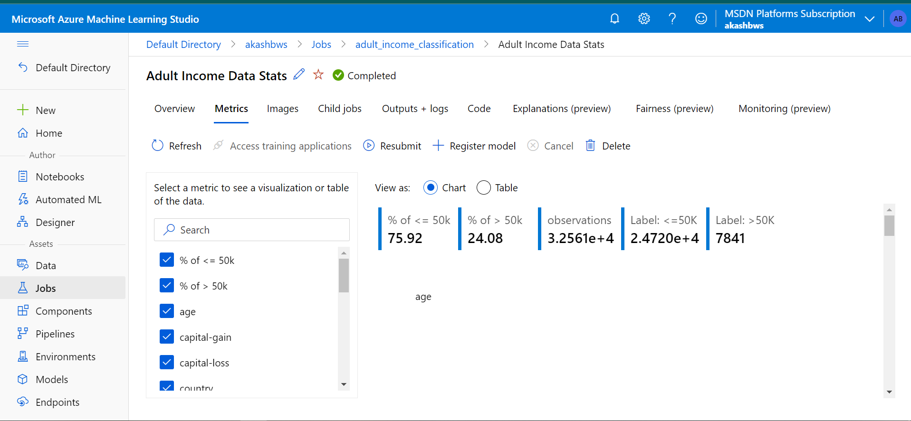
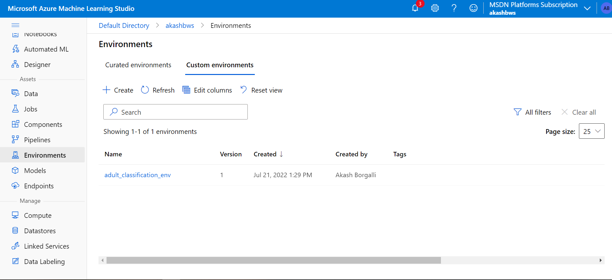
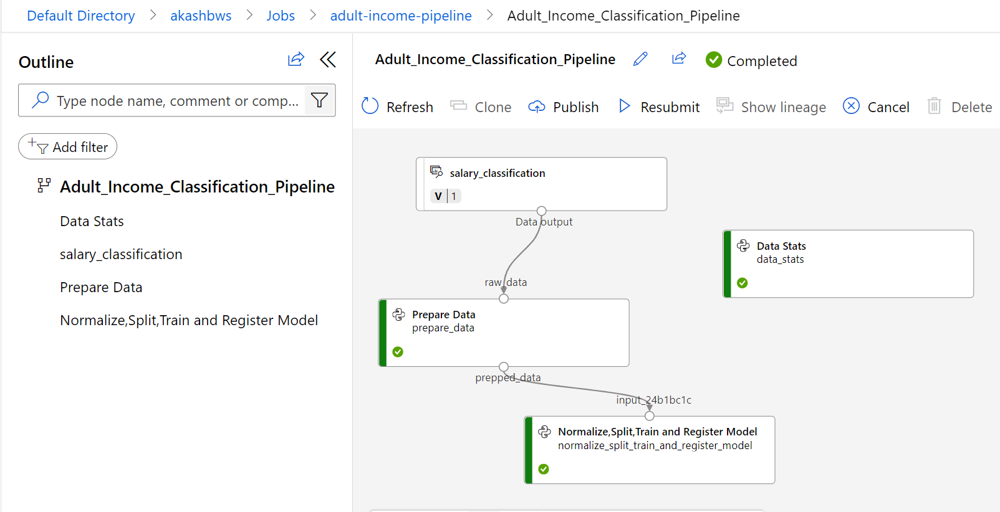
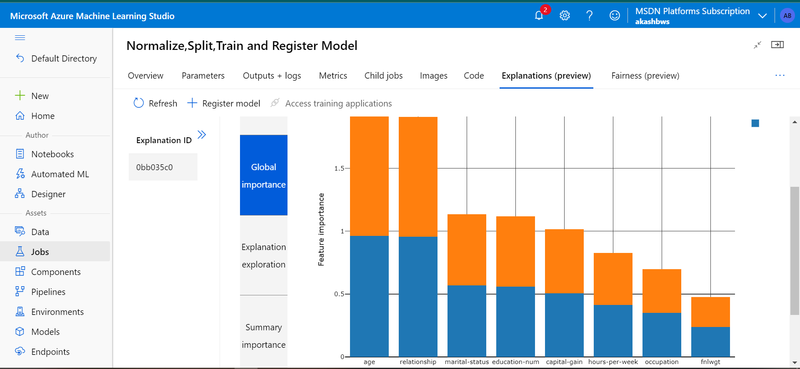
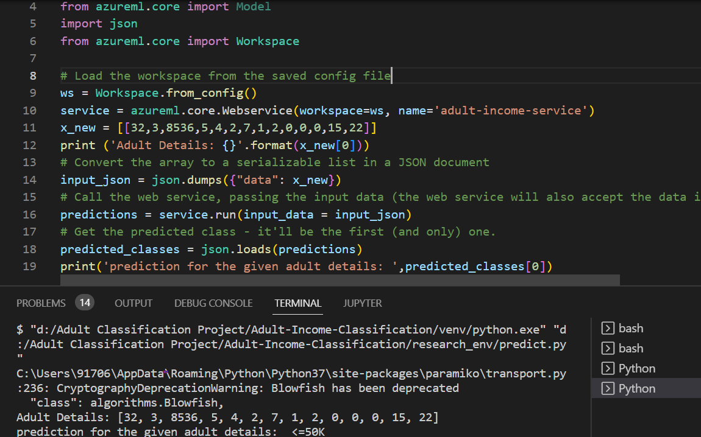
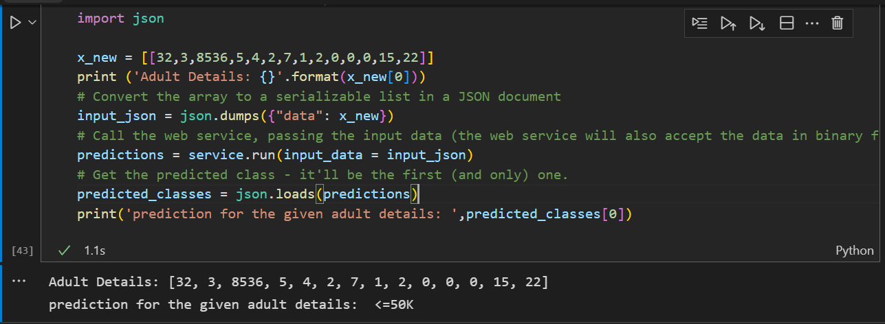

# Adult Income Machine Learning Classification Project (End to End)

🚩 ***Problem Statement***: \
The prominent inequality of wealth and income is
a huge concern especially in the United States. The likelihood
of diminishing poverty is one valid reason to reduce the world's
surging level of economic inequality. The principle of universal
moral equality ensures sustainable development and improve
the economic stability of a nation. Governments in different
countries have been trying their best to address this problem and
provide an optimal solution. The problem of income inequality
has been of great concern in the recent years. Making the
poor better off does not seem to be the sole criteria to be in
quest for eradicating this issue. People of the United States
believe that the advent of economic inequality is unacceptable
and demands a fair share of wealth in the society.

# 🎯***Solution***:
Building a robust machine learning model that would determine whether census income of an adult would be above 50K or not per year.

## 📜 Data Description:
The dataset provides 14 input variables that are a mixture of categorical, ordinal, and numerical data types. The complete list of variables is as follows:

- Age.
- Workclass.
- Final Weight.
- Education.
- Education Number of Years.
- Marital-status.
- Occupation.
- Relationship.
- Race.
- Sex.
- Capital-gain.
- Capital-loss.
- Hours-per-week.
- Country.
- Salary(Target Feature)

## 📝 Features used from AzureML for this project

- Maintains snapshot of code.
- Logs Important Metrics and images on experiment dashboards as well as print in system logs .
- Shows feature importance.
- Created ML Pipeline (Datastats --> data pre-processing --> Model Training )
- Published ML Pipeline for Scheduling to run every week.
- Predict Real-time from Azure Container Instance .

## ⚙️ Data Preprocessing Techniques used
Steps : 1. Applied Log Transformation over Age and final weight.\
2. Filled missing values with modes of workclass, occupation and country columns.\
3. Reduced no.of unique categories of education, maritial-status.\
4. Converted Salary feature to binary.\
5. Enforced label-encoding on entire dataset.\
6. Applied Smoteenn to handle imbalanceness of database.\
7. Transformed data using StandardScalar.

## ✔️ Deployment
- Used LightGBM Model for Deployment with AUC of 0.91.
- Deployed the model over Azure Container Instance.

## 💻 Tech Stack

**Cloud Platform:**  Azure Machine Learning 

**Language:** Python 3.6.2

## 💡 Screenshots:
- **Data Stats of an experiment over Azure**\

- **Label Distribution logged as image in AML**

- **Registered Environment**

- **Pipeline Execution**

- **Registered Model(Light Gradient Boosting Model)**

- **Output Execution**

## Author 

- [@Akash Borgalli](https://www.linkedin.com/in/akashborgalli/)

